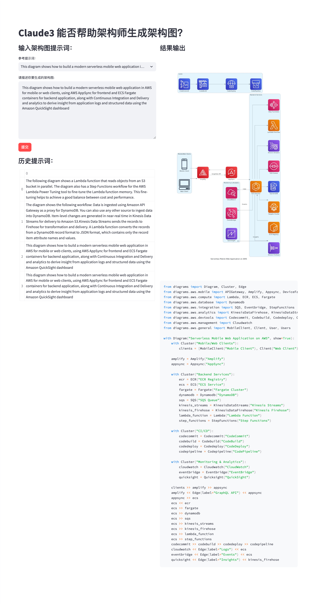

# 基于 Amazon Bedrock 学习 Claude3

[能否帮助架构师生成架构图？](https://mp.weixin.qq.com/s/IAzjRKrmrHzxe-NrByKqxQ)



# 基本环境

* 开发环境：
    -（1）使用 Web IDE Cloud9 或
    -（2）本地的 VSCode + 远程 EC2 （建议 Amazon Linux 2）(**推荐**)
    - (3) 授权 Cloud9 或 EC2 访问 Amazon Bedrock

* 下载 Demo：
  `git clone https://github.com/soldierxue/bedrock-claude3-sa-arch-diagram`

* 运行环境：
    * Python 3.9 + 
    * 依赖的 Python 库：
    `pip39 install -r ./requirements.txt -U`
    * Diagrams 操作系统层依赖库安装
    ```
    sudo yum update -y
    sudo yum install xdg-utils -y
    sudo yum install graphviz -y
    ```

* 启动 Demo:
  `streamlit run --server.port 8080 ./sa_arch_diagram_app.py`